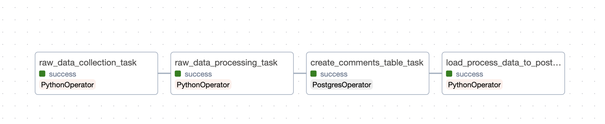

# A simple data pipeline worfklow

### Project Architecture
The project is based on theses components:
- [Airflow](https://airflow.apache.org/): The main orchestrator and scheduler of the project. It's a standard when it comes to etl pipelines.
- [Minio](https://min.io/): A S3 compatible storage. It's used as a storage layer for datalakes. We used it here as an object storage.
- [Postgres](https://www.postgresql.org/): A relational database. It's used  here as an analytics layer.
- [Pandas](https://pandas.pydata.org/): A python library for data manipulation and analysis.

### Workflow
[](images/dag.png)

As shown in the image above, the workflow is composed of 4 main steps:
We first collect the data from the api (https://jsonplaceholder.typicode.com/) and store the raw data without any transformation in the object storage. This is quite useful in case we need to reprocess the data (backfill).
Then we process the data and store it in our clean bucket before sending it to the postgres database.

### How to run the project
- create a python virtual environment using pyenv or virtualenv
- make sure you have docker and docker-compose installed
- run the following commands:
```bash
docker-compose up -d --build
```
- Once everything is up and running, you can access the airflow UI at http://localhost:8080 (default login/password: admin/admin)
- You can also access the minio UI at http://localhost:9000 (default login/password: minioadmin/minioadmin)
- The dag is named `trust_wallet_jsonplaceholder_api_data` and you can trigger it manually from the UI or wait for the scheduler to trigger it at the scheduled time.
- You can also access the postgres database to check the data using the following command inside the container:
```bash
psql -h localhost -U postgres -d mydb
```
### Improvements
- Better management of the secrets: We could use a secret manager like Hashicorp Vault or AWS Secrets Manager to store the secrets.
- Monitoring: For production, we could use a monitoring tool like Prometheus and Grafana to monitor the resources and the workflows.
- Take advantage of Cloud services: We could use for example rds for the database and s3 for the object storage and if needed use MWAA for the orchestration. This would reduce the maintenance overhead and having the storage outside the container would make it easier to scale.
- Using spark as procesing engine: For big data, we could use spark and use better storage format like table format for example.
- For analytics we could use an OLAP database like redshift or clickhouse.

### Author
Idrissa Magassa
